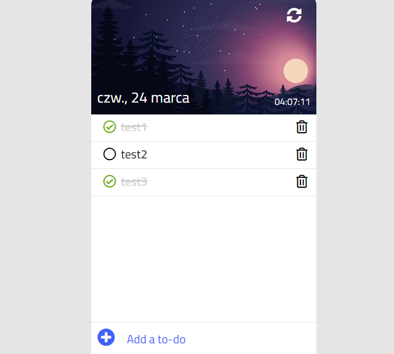

# To-Do-List 
> An app for creating a to-do list.
> You can check live demo [_here_](https://noszczykmichal.github.io/to-do-list/index.html).

## Table of Contents
* [General Info](#general-information)
* [Technologies Used](#technologies-used)
* [Screenshots](#screenshots)
* [Usage](#usage)
* [Project Status](#project-status)
* [Acknowledgements](#acknowledgements)
* [Contact](#contact)


## General Information
  This project was created on the basis of youtube tutorial on JavaScript (more info at [Acknowledgements](#acknowledgements)). 
  I modified the project to what can be find in the tutorial:
  - changed main header image
  - added few features on my own (e.g. list item added not only on 'Enter' key hit but also on mouse click, display of the user's local time)  

  After around two years I've come back to it and revised code with what I've learnt so far, mainly:
  - refactored the code resposible for DOM manipulation
  - fixed errors introduced by instructor 


## Technologies Used
- HTML5
- CSS3
- VanillaJS (es6)


## Screenshots



## Usage
Want to play with the app on your own?
```
# Clone this repository
$ git clone https://github.com/noszczykmichal/to-do-list-js
# Go to the source directory and open index.html file 
  in a browser of your choice
```
or check a live demo [_here_](https://noszczykmichal.github.io/to-do-list/index.html).

## Project Status
Project is completed and probably won't be developed with this setup. In the future I'm going to recreate this project with diffrent setup (React.js) adding new features e.g. 
- list saved online 
- many lists saved by the same user
- browsing through all the lists user has saved 


## Acknowledgements
This project was based on youtube tutorial [Create a To Do List App With JavaScript, HTML and CSS](https://www.youtube.com/watch?v=b8sUhU_eq3g).


## Contact
Created by [@noszczykmichal](https://noszczykmichal.github.io/portfolio/index.html#contact) - feel free to contact me!


